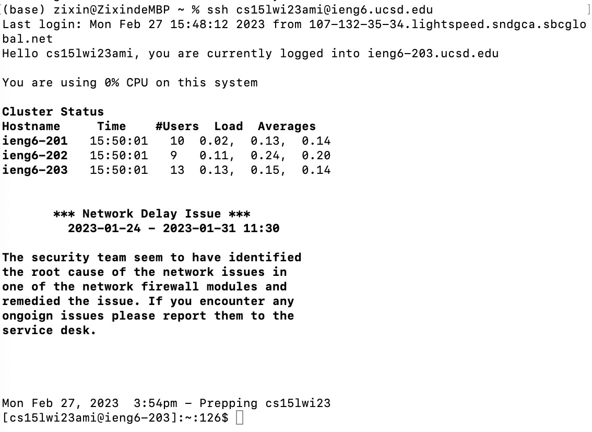
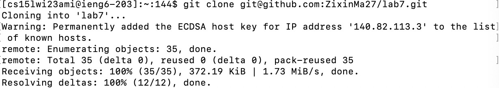
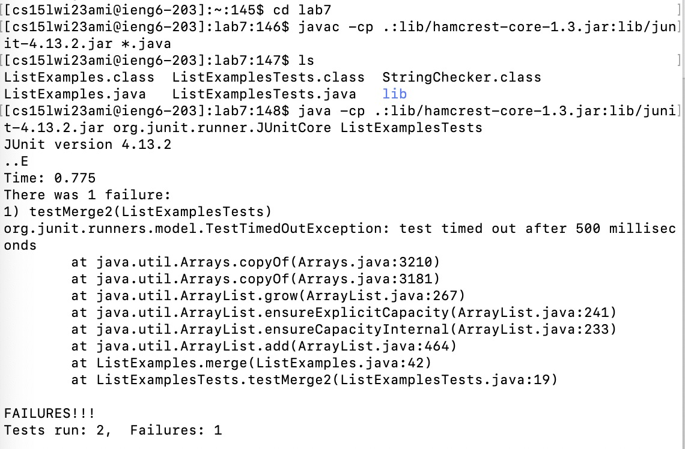
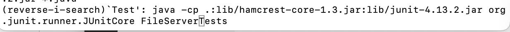
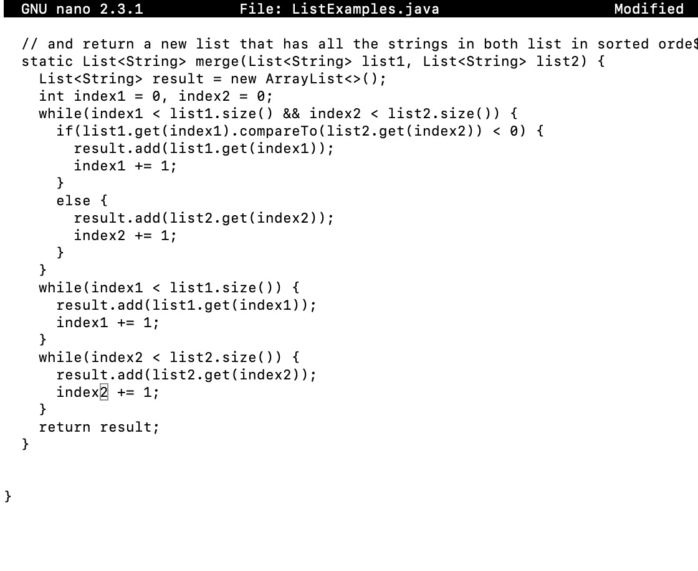
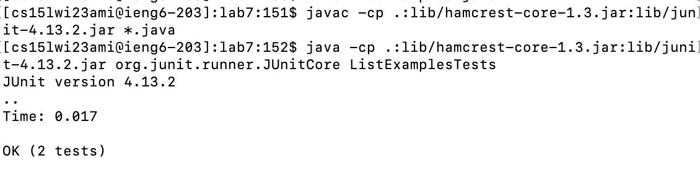
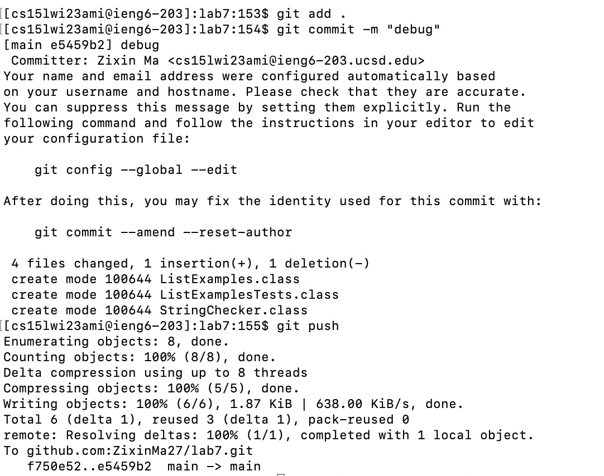

## Lab 4 Report
Name: Zixin Ma

Date: 2/27/2023

### Tasks
Reproduce the task (4-9) from the competition.

### Step 4: Log into ieng6.
Key Pressed:

First time: `ssh cs15lwi23ami@ieng6.ucsd.edu`

Repeat: `<control>` + `R`  + `ieng6` + `<return>`

Keypresses Effects: 
- `<control>` + `R`: Search the command history as I have previously typed. 
- `ieng6` +  `<return>` : when I entered keyword `ieng6`, then `ssh cs15lwi23ami@ieng6.ucsd.edu` appeared and pressed `<return>` to run the command.

### Step 5: Clone your fork of the repository from your Github account
Key Pressed:

First time: `<command>` + `C` the `<repo path from Github>`, then `git clone ` + `<command>`  + `D`.

Repeat: `<control>` + `R`  + `clone` + `<return>`

Keypresses Effects: 
- `<control>` + `R`: Search the command history as I have previously typed. 
- `clone` +  `<return>` : when I entered keyword `ieng6`, then `git clone git@github.com:ZixinMa27/lab7.git` appeared and pressed `<return>` to run the command.

### Step 6: Run the tests, demonstrating that they fail
Key Pressed:

First time: `cd lab 7` + `javac -cp .:lib/hamcrest-core-1.3.jar:lib/junit-4.13.2.jar *.java` + `ls` + `java -cp .:lib/hamcrest-core-1.3.jar:lib/junit-4.13.2.jar org.junit.runner.JUnitCore ListExamplesTests`

Repeat: `cd lab7` + `<control>` + `R`  + `javac` + `<return>` 

Keypresses Effects: 
- `cd lab7` : Entered lab7 folder
- `<control>` + `R`: Search the command history as I have previously typed. 
- `javac` +  `<return>` : when I entered keyword `javac`, then `javac -cp .:lib/hamcrest-core-1.3.jar:lib/junit-4.13.2.jar *.java` appeared and pressed `<return>` to run the command.
- `Test` +  `<return>` : when I entered keyword `Test`, then `java -cp .:lib/hamcrest-core-1.3.jar:lib/junit-4.13.2.jar org.junit.runner.JUnitCore ListExamplesTests` appeared and pressed `<return>` to run the command.

### Step 7: Edit the code file to fix the failing test
Key Pressed:

First time: `nano ListExamples.java` + `<down>` several times until the bug line + <right> several times until reach "1" + `<delete>` "1" + entered `2` + `<control>` + `O`  + `<control>` + `X`

Repeat: `nano L` + `<tab>` + `java` + `return` + `<down>` several times until the bug line + <right> several times until reach "1" + `<delete>` "1" + entered `2` +  `<control>` + `O`  + `<control>` + `X`

Keypresses Effects: 
- `nano L` : Open and edit file with key word start with "L"
- `<tab>` : "ListExamples" appeared
- `java` + `<return>` : open and edit the java file 
- `<down>` several times until the bug line + <right> several times until reach "1": find the location of bug. 
- `<delete>` "1" + entered `2`: fix the bug. 
- `<control>` + `O`  + `<control>` + `X`: save and exit the file.

### Step 8:Run the tests, demonstrating that they now succeed
Key Pressed:

First time and Repeat: `<up>` + `<up>` + `<up>` + `<return>` + `<up>` + `<up>` + `<up>` + `<return>`

Keypresses Effects: 
- `<up>` : `nano ListExamples.java` appeared
- `<up>` : `java -cp .:lib/hamcrest-core-1.3.jar:lib/junit-4.13.2.jar org.junit.runner.JUnitCore ListExamplesTests` appeared
- `<up>` +  `<return>` : `javac -cp .:lib/hamcrest-core-1.3.jar:lib/junit-4.13.2.jar *.java` appeared and  `<return>` run the command
- `<up>` : `javac -cp .:lib/hamcrest-core-1.3.jar:lib/junit-4.13.2.jar *.java` appeared
- `<up>` : `nano ListExamples.java` appeared
- `<up>` +  `<return>` : `java -cp .:lib/hamcrest-core-1.3.jar:lib/junit-4.13.2.jar org.junit.runner.JUnitCore ListExamplesTests` appeared and  `<return>` run the command

### Step 9: Commit and push the resulting change to your Github account
Key Pressed:

First time and Repeat: `git add .` + `<return>` + `git commit -m "debug"` + `<return>` + `git push` + `<return>`

Keypresses Effects: 
- `git add .` : add all the files and changes
- `git commit -m "debug"` : commit with message description
- `git push` : push the files and changes to github
