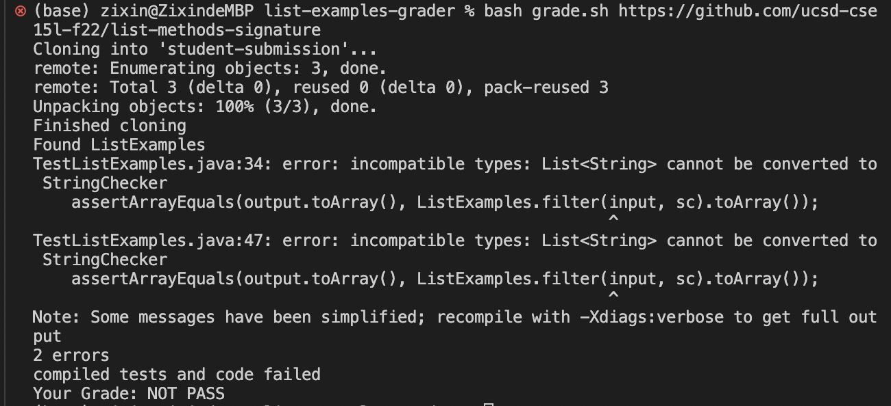

## Lab 5 Report
Name: Zixin Ma

Date: 3/13/2023

### Creating a Grading Script:
Here is my grading script:
```
CPATH='.:lib/hamcrest-core-1.3.jar:lib/junit-4.13.2.jar'

# 1. clone student repo
rm -rf student-submission
git clone $1 student-submission
echo 'Finished cloning'

# 2. check student code has correct file submitted
cd student-submission

if [[ -f ListExamples.java ]]
then 
    echo "Found ListExamples"
else 
    echo "Need file ListExample"
    exit 1
fi 

# 3.  get student code and test .java file into same directory
cp *.java ../
cd ..

# 4. compile tests and student's code from appropriate directory with appropriate classpath commands.
javac -cp $CPATH *.java

if [[ $? == 0 ]]
then 
    echo "compiled tests and code successfully"
else
    echo "compiled tests and code failed"
    echo "Your Grade: NOT PASS"
    exit 2
fi 

# 5. Run the tests and report the grade based on the JUnit output
java -cp $CPATH org.junit.runner.JUnitCore TestListExamples > output.txt

# If student passed all 3 tests, the student's grade is pass. 
# If student passed 2 tests, the student's grade is Partial pass.
# Else,  the student's grade is no pass.
grep "OK" output.txt > grade.txt
if [[ `grep -c "OK" grade.txt` == "0" ]]
then
    grep "Failures: 1" output.txt > fail.txt
    if [[ `grep -c "Failures: 1" fail.txt` == "1" ]]
    then
        echo "Your Grade: Partial PASS"
        exit 2
    fi
    echo "Your Grade: NOT PASS"
    exit 2
fi
echo "Your Grade: PASS!"
```

### Testing Grading Script
I used the following repositories to test my grader, and all of them behaved as I thought. If the student submission could not find the needed files or not compile successfully, it will automatically Not pass.
1. [https://github.com/ucsd-cse15l-f22/list-methods-lab3](https://github.com/ucsd-cse15l-f22/list-methods-lab3), which has the same code as the starter from lab 3

- Student Grade: Not Passed. It failed 2 or more Tests.
2. [https://github.com/ucsd-cse15l-f22/list-methods-corrected](https://github.com/ucsd-cse15l-f22/list-methods-corrected), which has the methods corrected (I would expect this to get full or near-to-full credit)

- Student Grade: Passed. It passed all 3 Tests.
3. [https://github.com/ucsd-cse15l-f22/list-methods-compile-error](https://github.com/ucsd-cse15l-f22/list-methods-compile-error), which has a syntax error of a missing semicolon. Note that your job is not to fix this, but to decide what to do in your grader with such a submission!

- Student Grade: Not Passed. It failed to compile files successfully.
4. [https://github.com/ucsd-cse15l-f22/list-methods-compile-error](https://github.com/ucsd-cse15l-f22/list-methods-signature), which has the types for the arguments of filter in the wrong order, so it doesn’t match the expected behavior.

- Student Grade: Not Passed. It failed to compile files successfully.
5. [https://github.com/ucsd-cse15l-f22/list-methods-filename](https://github.com/ucsd-cse15l-f22/list-methods-filename), which has a great implementation saved in a file with the wrong name.

- Student Grade: Not Passed. It failed to find the needed files.
6. [https://github.com/ucsd-cse15l-f22/list-methods-nested](https://github.com/ucsd-cse15l-f22/list-methods-nested), which has a great implementation saved in a nested directory called pa1.

- Student Grade: Not Passed. It failed to find the needed files.
7. Challenge [https://github.com/ucsd-cse15l-f22/list-examples-subtle](https://github.com/ucsd-cse15l-f22/list-examples-subtle), which has more subtle bugs (hints: see assertSame, which compares with == rather than .equals(), and think hard about duplicates for merge)

- Student Grade: Partial Passed. It failed 1 out of 3 tests.
