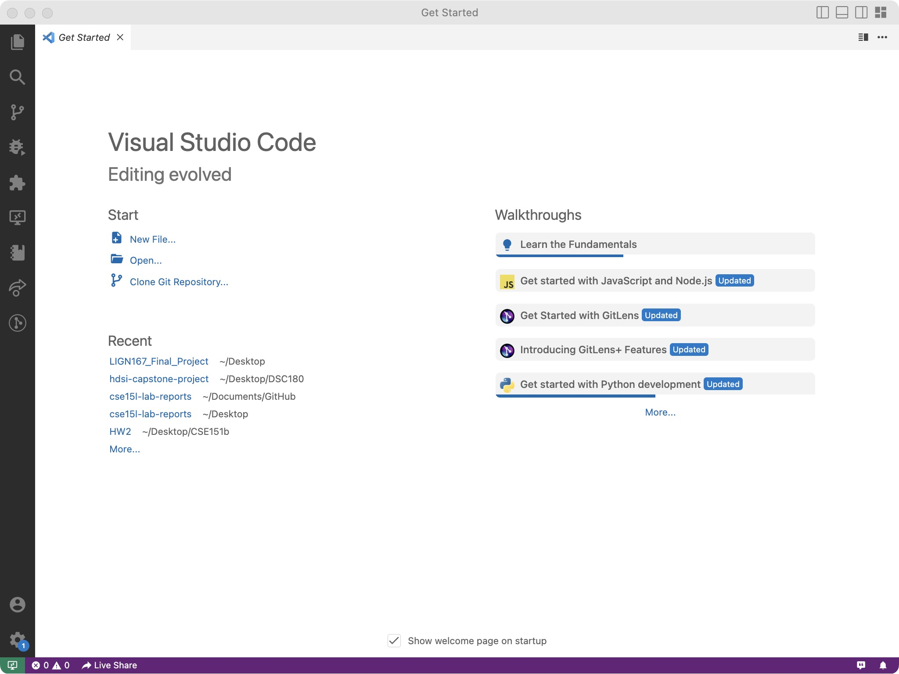
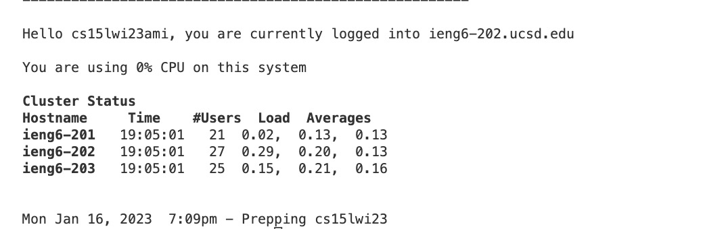
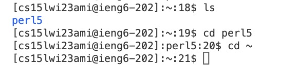

# Lab 1 Report

Tutorial for lab 1


## Part 1: Installing VScode
1. Download the vscode from [(https://code.visualstudio.com/)](https://code.visualstudio.com/)
2. Take the screenshot after opening VScode, it should look like below: 


## Part 2: Remotely Connecting
1. Open a terminal in VScode. In the terminal, enter your `ssh` + your course-specific account. (**Remember to replace "zz" by your letters.** )
```
⤇ ssh cs15lwi23zz@ieng6.ucsd.edu 
```  


2. Then enter the password, and take a screenshot after you successfully connect to the remote server, it should look like below: \



## Part 3: Trying Some Commands
1. Try some commands. Here are some useful commands to try: 

*  `cd ~`
*  `cd`
*  `ls`
*  `pwd`
*  `cat <directory>`
*  `exit`

Hint: cheatsheet for Linux commands. [https://www.guru99.com/linux-commands-cheat-sheet.html](https://www.guru99.com/linux-commands-cheat-sheet.html)

2. After running some commands, you can choose one example, take a screenshot and give a short explaination. 

> Here is an example: \
>  \
> Explanation: First, Ran `ls` shows the files and folders in the current directory, in this case, perl5 a folder in this directory. Then ran `cd <path>` onto one of the folders, then ran `cd ~` to return the start of the path.  

