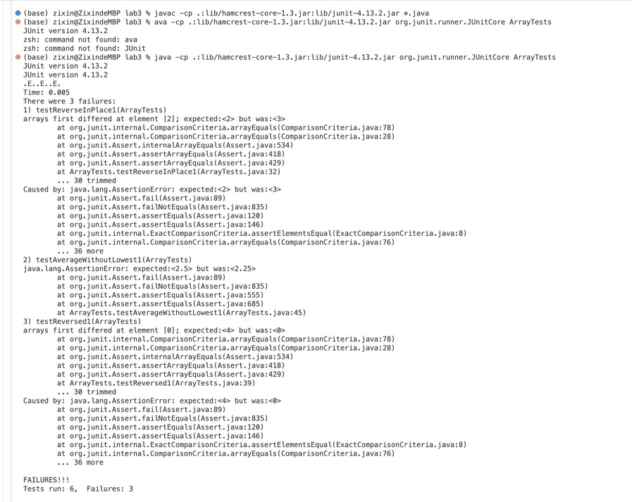

# Lab Report 2 - Servers and Bugs

## Part 1 Web Server
1. Show code for `StringServer.java`

```
import java.io.IOException;
import java.net.URI;
import java.util.ArrayList;

class Handler implements URLHandler {
    ArrayList<String> messages = new ArrayList<String>(); 
    public String listStr(ArrayList<String> a){
        StringBuilder str = new StringBuilder();
        for (Object o : messages){
            str.append(o.toString());
            str.append("\n");
        }
        return str.toString();
    }

    public String handleRequest(URI url) {
        if (url.getPath().equals("/")) {
            return listStr(messages);
        } else {
            if (url.getPath().contains("/add-message")) {
                String[] parameters = url.getQuery().split("=");
                if (parameters[0].equals("s")) {
                    terms.add(parameters[1]);
                    return listStr(messages);
                }
            }
            return "404 Not Found!";
        }
    }
}
public class StringServer {
    public static void main(String[] args) throws IOException {
        if(args.length == 0){
            System.out.println("Missing port number! Try any number between 1024 to 49151");
            return;
        }
        int port = Integer.parseInt(args[0]);
        Server.start(port, new Handler());
    }
}
```

2. Two screenshot and description.
* Screenshot 1:


* Which methods in your code are called?
What are the relevant arguments to those methods, and the values of any relevant fields of the class?
How do the values of any relevant fields of the class change from this specific request? If no values got changed, explain why.
* The string is added to arraylist named messages.
 if (url.getPath().contains("/add-message")) {
                String[] parameters = url.getQuery().split("=");
                if (parameters[0].equals("s")) {
                    terms.add(parameters[1]);
                    return listStr(terms);
                }
            }
            
* Screenshot 2:


## Part 2  Bugs from `ArrayExample.java`

1. A failure-inducing input for the buggy program, as a JUnit test and any associated code.

```
# JUnit test for reverseInplace Method
@Test 
public void testReverseInPlace1() {
    int[] input = { 1, 2, 3, 4};
    ArrayExamples.reverseInPlace(input);
    int[] expect = {4, 3, 2, 1};
    assertArrayEquals(expect, input);
}

# JUnit test for reversed Method
@Test
public void testReversed1() {
    int[] input = {1, 2, 3, 4};
    int[] expect = {4, 3, 2, 1};
    assertArrayEquals(expect, ArrayExamples.reversed(input));
}

# JUnit test for averageWithoutLowest Method
@Test 
public void testAverageWithoutLowest1(){
    double[] input1 = {1,1,2,3,4};
    assertEquals(2.5, ArrayExamples.averageWithoutLowest(input1), 0);
}
```

2. An input that doesn’t induce a failure, as a JUnit test and any associated code.

```
# JUnit test for reverseInPlace Method, not trigger failure
@Test 
public void testReverseInPlace2() {
    int[] input1 = { 3 };
    ArrayExamples.reverseInPlace(input1);
    int[] expect = { 3 };
    assertArrayEquals(expect, input1);
}

# JUnit test for reversed Method, not trigger failure
@Test
public void testReversed2() {
    int[] input1 = { };
    assertArrayEquals(new int[]{ }, ArrayExamples.reversed(input1));
}

# JUnit test for averageWithoutLowest Method, not trigger failure
@Test 
public void testAverageWithoutLowest2(){
    double[] input1 = {10};
    assertEquals(0, ArrayExamples.averageWithoutLowest(input1), 0);
}
```

3. The symptom, as the output of running the tests. As I expected, I ran 6 tests, only 3 of them did not fail, which were `testReversedInPlace2`, `testReversed2`, `testAverageWithoutLowest2`. And 3 tests failed.
> For `testReversedInPlace1`, the expected output is {4,3,2,1}, but got {4,3,3,4}. 

> For `testReversed1`, the expected output is {4,3,2,1}, but got {0,0,0,0}. 

> For `testAverageWithoutLowest1`, the expected output is {2.5}, but got {2.25}. 



4. The bug, as the before-and-after code change required to fix it (as two code blocks in Markdown). Briefly describe why the fix addresses the issue
* Bug code for `reverseInplace` method. The problem was that the code will not work if the length of input array is greater than 1. For example, {1,2,3,4} will be {4,3,3,4}, instead of {4,3,2,1}. 

```
// Changes the input array to be in reversed order
static void reverseInPlace(int[] arr) {
    for(int i = 0; i < arr.length; i += 1) {
        arr[i] = arr[arr.length - i - 1]; //bug line
    }
}
```

* Fixed code for `reverseInplace` method. Now, the problem solved. Instead of looping through the array, I loop half of the array, and used a third variable as temporary storage to swap the elements. So it makes sure that swapped element became the original first value, instead of the changed first element’s value. 

```
static void reverseInPlace(int[] arr) {
    for (int i = 0; i < arr.length / 2; i++){
        int temp = arr[i];
        arr[i] = arr[arr.length - 1 - i];
        arr[arr.length -1 -i] = temp;
    }
}
```

* Bug code for `reversed` method. The problem was that it set the values of newArray to orginal array's value and returns to the original array. However, the values inside the newArray are all 0. 

```
// Returns a *new* array with all the elements of the input array in reversed order
static int[] reversed(int[] arr) {
    int[] newArray = new int[arr.length];
    for(int i = 0; i < arr.length; i += 1) {
        arr[i] = newArray[arr.length - i - 1]; // bug line
    }
    return arr;
}
```

* Fixed code for `reversed` method. Now, the problem solved. I assigned the the values of original array to new array and returns to the new array. 

```
static int[] reversed(int[] arr) {
    int[] newArray = new int[arr.length];
    for(int i = 0; i < arr.length; i += 1) {
        newArray[i] = arr[arr.length - i - 1]; // assign original array to new array
    }
    return newArray; // return the new array
}
```

* Bug code for `averageWithoutLowest` method. The problem was that the code will not work if there is two or more lowest number that are equal to each other. `if(num != lowest) { sum += num; }` code here means whenever the number is equal to lowest value, it will not be calculate. 

```
// Averages the numbers in the array (takes the mean), but leaves out the 
// lowest number when calculating. Returns 0 if there are no elements or just
// 1 element in the array
static double averageWithoutLowest(double[] arr) {
    if(arr.length < 2) { return 0.0; }
    double lowest = arr[0];
    for(double num: arr) {
        if(num < lowest) { lowest = num; }
    }
    double sum = 0;
    for(double num: arr) {
        if(num != lowest) { sum += num; } // Bug: exclude all the lowest numbers
    }
    return sum / (arr.length - 1);
}
```

* Fixed code for `averageWithoutLowest` method. Now, the problem solved, after sum all the numbers, then minus the lowest number. We only leave out one lowest number instead of all numbers that are equal to the lowest number.

```
static double averageWithoutLowest(double[] arr) {
    if(arr.length < 2) { return 0.0; }
    double lowest = arr[0];
    for(double num: arr) {
        if(num < lowest) { lowest = num; }
    }
    double sum = 0;
    for(double num: arr) {
        sum += num; 
    }
    sum =  sum - lowest; // drop the lowest
    return sum / (arr.length - 1);
}
```

## Part 3 Lab Lessons
From lab in week 2, I learned how to construct a basic server and operate it on my personal computer. This will aid me in constructing future websites. From lab in week 3, I gained knowledge on debugging by writing JUnit tests, which will be useful in verifying the functionality of my code in all scenarios.
